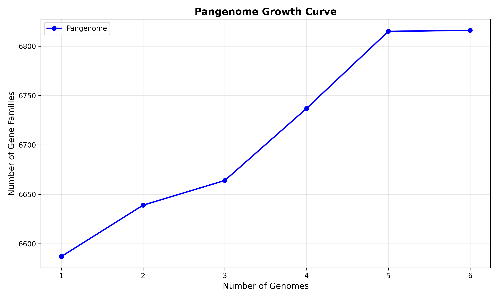
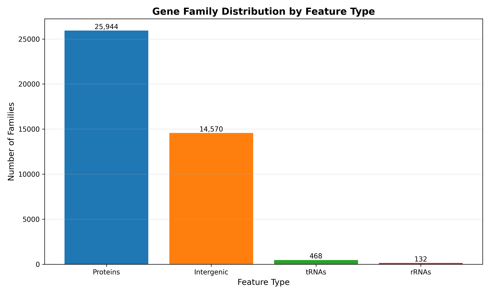
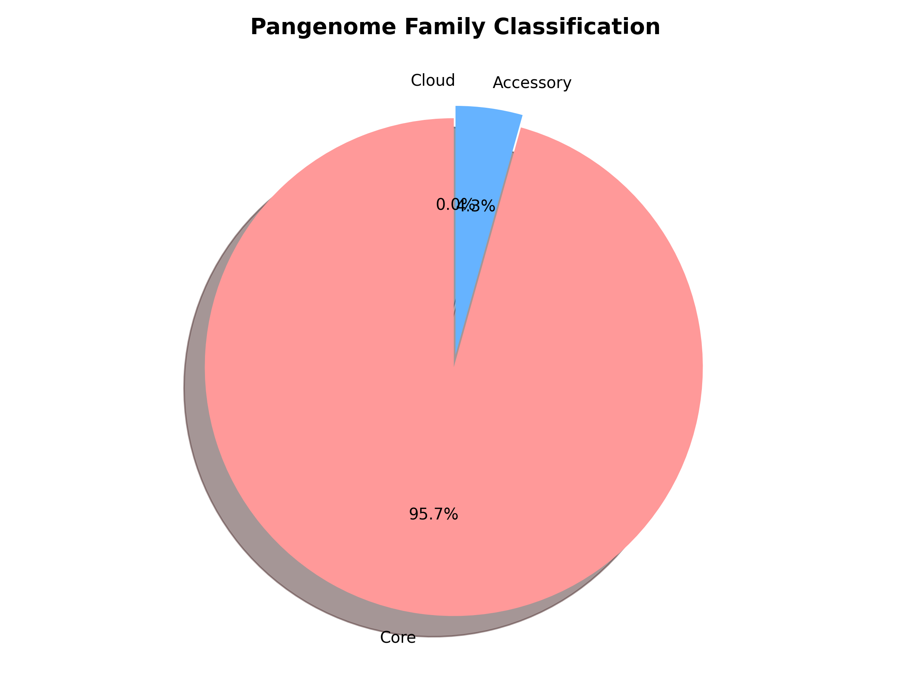
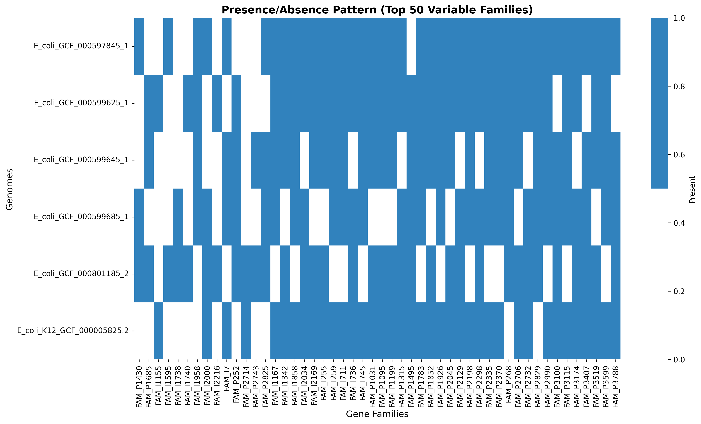

# PanGenomePlus

**Comprehensive pangenome analysis for prokaryotic genomes**

PanGenomePlus is a Python-based pangenome analysis pipeline that analyzes **all genomic features** across multiple bacterial or archaeal genomes, including protein-coding genes, intergenic regions, tRNAs, rRNAs, and CRISPR elements.

## Key Features

- **Complete feature analysis**: Proteins, intergenic regions, tRNAs, rRNAs, CRISPR elements
- **Homology-based clustering**: MMseqs2 for fast, accurate sequence clustering
- **Core/accessory/cloud classification**: Identifies universally shared and variable genomic content
- **Multiple output formats**: Transformer-ready sequences, presence/absence matrices, Roary-compatible format
- **Scalable**: Handles 10s to 1000s of genomes efficiently
- **Simple interface**: Single command execution with sensible defaults
- **Checkpoint recovery**: Resume interrupted analyses

## Requirements

### System Requirements
- **Operating System**: Linux or macOS
- **Memory**: 8GB minimum (scales with dataset size)
- **Disk Space**: Varies by dataset (typically 2-10x genome data size)
- **Python**: 3.8 or higher

### External Tool Dependencies

PanGenomePlus orchestrates specialized bioinformatics tools. You must install these tools before running the pipeline:

#### Required Tools

1. **Prodigal** - Gene prediction
   ```bash
   # Ubuntu/Debian
   sudo apt-get install prodigal

   # macOS (Homebrew)
   brew install prodigal

   # Conda
   conda install -c bioconda prodigal
   ```

2. **MMseqs2** - Sequence clustering (version 13+)
   ```bash
   # Ubuntu/Debian
   sudo apt-get install mmseqs2

   # macOS (Homebrew)
   brew install mmseqs2

   # Conda
   conda install -c bioconda mmseqs2
   ```

3. **tRNAscan-SE** - tRNA detection (version 2.0+)
   ```bash
   # Ubuntu/Debian
   sudo apt-get install trnascan-se

   # macOS (Homebrew)
   brew install trnascan-se

   # Conda
   conda install -c bioconda trnascan-se
   ```

4. **Barrnap** - rRNA detection (version 0.9+)
   ```bash
   # Ubuntu/Debian
   sudo apt-get install barrnap

   # macOS (Homebrew)
   brew install barrnap

   # Conda
   conda install -c bioconda barrnap
   ```

5. **MINCED** - CRISPR detection (version 0.4+)
   ```bash
   # Conda
   conda install -c bioconda minced

   # Manual installation
   git clone https://github.com/ctSkennerton/minced.git
   cd minced && make
   # Add to PATH
   ```

#### Verify Installation
All tools must be accessible via your `PATH`. Test with:
```bash
prodigal -v
mmseqs version
tRNAscan-SE -h
barrnap --version
minced --version
```

## Installation

### Option 1: Install from PyPI (when available)
```bash
pip install pangenomeplus
```

### Option 2: Install from GitHub
```bash
# Clone repository
git clone https://github.com/mol-evol/pangenomeplus.git
cd pangenomeplus

# Install in development mode
pip install -e .
```

### Option 3: Install in Virtual Environment (recommended)
```bash
# Create virtual environment
python3 -m venv pgp-env
source pgp-env/bin/activate  # On Windows: pgp-env\Scripts\activate

# Clone and install
git clone https://github.com/mol-evol/pangenomeplus.git
cd pangenomeplus
pip install -e .
```

## Quick Start

### Basic Usage
```bash
# Analyze genomes in a directory
pangenomeplus --genome-dir /path/to/genomes --output-dir results

# Analyze with downstream analysis (visualizations, rarefaction curves, reports)
pangenomeplus --genome-dir genomes/ \
              --output-dir my_analysis/ \
              --enable-downstream-analysis

# Analyze with specific options
pangenomeplus --genome-dir genomes/ \
              --output-dir my_analysis/ \
              --threads 8 \
              --clustering-identity 0.8
```

### Example Usage
```bash
# Basic analysis with your genomes
pangenomeplus --genome-dir /path/to/genomes/ --output-dir output/

# With downstream analysis and visualizations
pangenomeplus --genome-dir /path/to/genomes/ \
              --output-dir output/ \
              --enable-downstream-analysis
```

## Input Data

### Genome Files
- **Format**: FASTA files (`.fasta`, `.fna`, `.fa`)
- **Content**: Assembled genomic sequences (complete or draft genomes)
- **Quality**: High-quality assemblies recommended (contaminant-free, well-assembled)
- **Organization**: All genome files in a single directory

### Directory Structure
```
my_genomes/
├── genome_001.fasta
├── genome_002.fasta
├── genome_003.fna
└── genome_004.fa
```

### Quality Recommendations
- Use complete or near-complete genome assemblies
- Remove contamination before analysis
- Verify assemblies represent single organisms (not metagenomes)

## Usage Tutorial

### Step 1: Prepare Your Genomes
Place all genome FASTA files in a directory:
```bash
mkdir my_genomes
cp /path/to/*.fasta my_genomes/
```

### Step 2: Run Basic Analysis
```bash
pangenomeplus --genome-dir my_genomes --output-dir pangenome_results
```

This will:
1. Run gene prediction (Prodigal)
2. Detect tRNAs (tRNAscan-SE)
3. Detect rRNAs (Barrnap)
4. Detect CRISPR elements (MINCED)
5. Extract intergenic regions
6. Cluster all features by homology
7. Classify gene families (core/accessory/cloud)
8. Generate output files

### Step 3: Customize Analysis

#### Adjust Clustering Stringency
```bash
# More relaxed clustering (broader families)
pangenomeplus --genome-dir my_genomes --output-dir results_relaxed \
              --clustering-identity 0.7 --clustering-coverage 0.7

# More strict clustering (narrower families)
pangenomeplus --genome-dir my_genomes --output-dir results_strict \
              --clustering-identity 0.9 --clustering-coverage 0.9
```

#### Analyze Only Proteins
```bash
pangenomeplus --genome-dir my_genomes --output-dir protein_only \
              --protein-only
```

#### Skip Specific Feature Types
```bash
# Skip CRISPR analysis
pangenomeplus --genome-dir my_genomes --output-dir no_crispr \
              --skip-crispr

# Skip tRNA and rRNA analysis
pangenomeplus --genome-dir my_genomes --output-dir no_rna \
              --skip-trna --skip-rrna
```

### Step 4: Resume Interrupted Analysis
If analysis is interrupted, simply re-run the same command. PanGenomePlus will detect completed stages and resume from the last checkpoint.

## Command-Line Options

### Required Arguments
- `--genome-dir PATH` - Directory containing genome FASTA files
- `--output-dir PATH` - Directory for output files (created if doesn't exist)

### Feature Selection
- `--protein-only` - Analyze only protein-coding genes
- `--non-coding-only` - Analyze only non-coding features
- `--skip-trna` - Skip tRNA analysis
- `--skip-rrna` - Skip rRNA analysis
- `--skip-crispr` - Skip CRISPR analysis
- `--skip-intergenic` - Skip intergenic region extraction

### Clustering Parameters
- `--clustering-identity FLOAT` - Sequence identity threshold (default: 0.8, range: 0.0-1.0)
- `--clustering-coverage FLOAT` - Coverage threshold (default: 0.8, range: 0.0-1.0)
- `--clustering-sensitivity FLOAT` - MMseqs2 sensitivity (default: 4.0, range: 1.0-8.0)
- `--coverage-mode {query,target,bidirectional}` - Coverage calculation method (default: bidirectional)
- `--cluster-mode {set-cover,connected-component,greedy}` - Clustering algorithm (default: set-cover)

### Tool-Specific Parameters

#### Prodigal
- `--prodigal-mode {single,meta}` - Gene prediction mode (default: single)
- `--translation-table INT` - Genetic code table 1-25 (default: 11 for bacteria)

#### tRNAscan-SE
- `--trna-model {bacteria,archaea,eukaryota,mitochondrial}` - Organism model (default: bacteria)
- `--trna-score-cutoff FLOAT` - Detection score threshold (default: 20.0)
- `--trna-search-mode {relaxed,normal,strict}` - Search stringency (default: normal)

#### Barrnap
- `--rrna-kingdom {bac,arc,euk,mito}` - Kingdom-specific model (default: bac)
- `--rrna-evalue FLOAT` - E-value threshold (default: 1e-6)

#### MINCED
- `--crispr-min-repeats INT` - Minimum repeat count for CRISPR array (default: 3)
- `--crispr-repeat-length-range MIN,MAX` - Repeat length bounds (default: 23,47)
- `--crispr-spacer-length-range MIN,MAX` - Spacer length bounds (default: 26,50)

### Annotation Input
- `--use-existing-annotations` - Use existing GFF3 files if found (skips Prodigal)

### Downstream Analysis
- `--enable-downstream-analysis` - Generate rarefaction curves, visualizations, and summary reports
- `--rarefaction-iterations INT` - Number of iterations for rarefaction curves (default: 100)
- `--rarefaction-step-size INT` - Genome step size for rarefaction sampling (default: 1)

### Performance
- `--threads INT` - Number of parallel threads (default: auto-detect)
- `--memory-limit SIZE` - Memory limit for MMseqs2 (default: auto)
- `--log-level {DEBUG,INFO,WARNING,ERROR}` - Logging verbosity (default: INFO)

## Output Files

PanGenomePlus generates multiple output formats in the specified output directory:

### Directory Structure
```
output_dir/
├── intermediate/           # Per-genome annotation files
│   └── genome_001/
│       ├── genome_001_proteins.faa
│       ├── genome_001_genes.gff
│       ├── genome_001_trna.txt
│       ├── genome_001_rrna.gff
│       └── genome_001_crispr.txt
├── features/              # Combined feature FASTA files with compact IDs
│   ├── P_protein_coding_gene.fasta
│   ├── T_tRNA.fasta
│   ├── R_rRNA.fasta
│   ├── C_CRISPR.fasta
│   └── I_intergenic_region.fasta
├── clusters/              # MMseqs2 clustering results
│   ├── P_cluster_results.tsv
│   ├── T_cluster_results.tsv
│   ├── R_cluster_results.tsv
│   ├── C_cluster_results.tsv
│   └── I_cluster_results.tsv
├── families/              # Gene family assignments
│   ├── P_family_assignments.tsv
│   ├── T_family_assignments.tsv
│   └── family_stats.json
├── matrices/              # Presence/absence matrices
│   ├── presence_absence_matrix.csv
│   └── family_summary.tsv
├── transformer/           # Transformer-ready format
│   └── pangenome_transformer.txt
├── roary/                 # Roary-compatible outputs
│   └── roary_compatible_output.csv
├── mappings/              # ID mapping tables
│   └── compact_id_mappings.json
├── analysis/              # Downstream analysis results (if --enable-downstream-analysis)
│   ├── pangenome_report.md
│   ├── rarefaction_curves.csv
│   ├── pangenome_structure_report.txt
│   ├── pangenome_structure_data.json
│   └── visualizations/
│       ├── rarefaction_curves.png
│       ├── feature_type_distribution.png
│       ├── family_classification.png
│       └── presence_absence_heatmap.png
└── logs/                  # Execution logs
    └── pangenomeplus_YYYYMMDD_HHMMSS.log
```

### Key Output Files

#### 1. Feature Sequences (`features/`)
FASTA files containing extracted sequences for each feature type with compact IDs:
- `P_protein_coding_gene.fasta` - Protein sequences (headers: P1, P2, P3...)
- `T_tRNA.fasta` - tRNA sequences (headers: T1, T2, T3...)
- `R_rRNA.fasta` - rRNA sequences (headers: R1, R2, R3...)
- `C_CRISPR.fasta` - CRISPR spacer sequences (headers: C1, C2, C3...)
- `I_intergenic_region.fasta` - Intergenic sequences (headers: I1, I2, I3...)

#### 2. Cluster Assignments (`clusters/`)
Tab-separated files mapping sequences to cluster representatives:
```
representative_id    member_id
P1                   P1
P1                   P523
P1                   P1042
P2                   P2
```

#### 3. Gene Families (`families/`)
- `gene_to_family.tsv` - Maps compact IDs to family IDs
  ```
  compact_id    family_id    genome_id
  P1            FAM_P1       genome_001
  P523          FAM_P1       genome_002
  T1            FAM_T1       genome_001
  ```

- `family_summary.tsv` - Family statistics and classification
  ```
  family_id    size    num_genomes    classification    feature_type
  FAM_P1       150     100            core              protein
  FAM_P2       45      30             accessory         protein
  FAM_T1       98      98             core              tRNA
  ```

#### 4. Presence/Absence Matrix (`matrices/presence_absence_matrix.csv`)
Binary matrix showing which families are present in each genome:
```
genome_id,FAM_P1,FAM_P2,FAM_P3,FAM_T1,...
genome_001,1,1,0,1,...
genome_002,1,0,1,1,...
genome_003,1,1,1,1,...
```

#### 5. Transformer Format (`transformer/pangenome_transformer.txt`)
Genome sequences represented as space-separated family tokens in genomic coordinate order:
```
>genome_001
FAM_P1 FAM_I5 FAM_P2 FAM_T42 FAM_P3 FAM_I7 FAM_R2 FAM_P4 ...
>genome_002
FAM_P1 FAM_I12 FAM_P5 FAM_T42 FAM_P6 FAM_I3 FAM_R2 FAM_P2 ...
```

#### 6. Compact ID Mappings (`mappings/compact_id_mappings.json`)
Complete mapping between compact IDs and full genomic metadata:
```json
{
  "P1": {
    "genome_id": "genome_001",
    "contig": "chromosome",
    "start": 47,
    "end": 1450,
    "strand": "+",
    "feature_type": "protein_coding_gene"
  }
}
```

#### 7. Downstream Analysis Outputs (`analysis/`)
Generated when using `--enable-downstream-analysis`:

**Markdown Summary Report** (`pangenome_report.md`):
- Comprehensive pangenome analysis summary
- Embedded visualizations
- Core/accessory/cloud family statistics
- Feature type breakdown
- Pangenome openness classification

**Rarefaction Data** (`rarefaction_curves.csv`):
- Pangenome, core, and accessory genome growth curves
- Statistical data for visualization

**Visualizations** (`visualizations/`):
- `rarefaction_curves.png` - Pangenome growth curves showing family accumulation
- `feature_type_distribution.png` - Bar chart of families by feature type
- `family_classification.png` - Pie chart of core/accessory/cloud proportions
- `presence_absence_heatmap.png` - Top 50 most variable families across genomes

**Structured Data** (`pangenome_structure_data.json`):
- Machine-readable pangenome statistics
- Openness analysis results

#### 8. Log Files (`logs/`)
Detailed execution logs with timestamps, warnings, and error messages.

## Interpreting Results

### Core, Accessory, and Cloud Genomes

PanGenomePlus classifies gene families based on genome presence:

- **Core families** (≥95% genomes): Present in nearly all genomes
- **Accessory families** (15-95% genomes): Present in 15-95% of genomes
- **Cloud families** (<15% genomes): Present in fewer than 15% of genomes

### Understanding Family Sizes

Check `family_summary.tsv` for family statistics:
- **Large core families**: Indicates highly conserved genes
- **Many singletons**: Normal for intergenic regions; high levels for proteins may indicate:
  - Highly diverse dataset
  - Sequencing/assembly quality issues
  - Too strict clustering parameters

### Quality Indicators

**Good analysis:**
- Core protein families: 2,000-5,000 (for typical bacteria)
- Singleton rate: <20% for proteins
- tRNA families: ~40-60 (one per anticodon type)
- rRNA families: 1-3 per subunit type

**Potential issues:**
- Very few core families: Dataset may be too diverse
- Extremely high singletons: Check clustering parameters or genome quality
- No CRISPR families: Normal - not all bacteria have CRISPR systems

### Using the Output

**For phylogenetic analysis:**
- Use `core_genome.tsv` for phylogenomic trees
- Use presence/absence matrices for gene content trees

**For machine learning:**
- Use `pangenome_transformer.txt` for sequence modeling
- Use presence/absence matrices for classification tasks

**For comparative genomics:**
- Examine accessory families for niche adaptations
- Identify strain-specific genes in cloud families

## Getting Started

To test PanGenomePlus, prepare a directory with genome files in FASTA format (.fasta, .fna, or .fa):

```bash
# Run complete analysis with visualizations
pangenomeplus --genome-dir /path/to/your/genomes/ \
              --output-dir output/ \
              --enable-downstream-analysis

# Runtime: ~2 minutes for 6 E. coli genomes on standard hardware
```

### Example Results

Analysis of 6 *E. coli* genomes produced:

**Features extracted**:
- 29,836 proteins → 7,276 families
- 15,525 intergenic regions → 3,596 families
- 576 tRNAs → 96 families
- 132 rRNAs → 3 families
- 87 CRISPR elements → 87 families

**Total**: 46,156 features clustered into 11,058 families

**Classification** (all feature types combined):
- **Core families** (≥95%): 5,151 families (46.6%)
  - Proteins: 3,380 core families
  - Intergenic regions: 1,739 core families
  - tRNAs: 29 core families
  - rRNAs: 3 core families
  - CRISPR: 0 core families
- **Accessory families** (15-95%): 5,907 families (53.4%)
- **Cloud families** (<15%): 0 families

**Pangenome type**: OPEN (growth rate: 780 families/genome)


*Figure 1: Pangenome growth curve showing family accumulation across 6 E. coli genomes.*


*Figure 2: Distribution of gene families by feature type (proteins, intergenic regions, tRNAs, rRNAs).*


*Figure 3: Proportional distribution of core and accessory families (47% core, 53% accessory).*


*Figure 4: Presence/absence patterns for the 50 most variable gene families across all 6 genomes.*

## Troubleshooting

### Tool Not Found Errors
**Error**: `Command 'prodigal' not found`
**Solution**: Install missing external tools (see Requirements section)

### Memory Errors
**Error**: `MemoryError` or MMseqs2 memory issues
**Solution**:
- Reduce `--max-seqs` parameter (default: 10000)
- Increase available RAM
- Process genomes in smaller batches

### Empty Output
**Issue**: No families generated
**Solution**:
- Check genome file format (must be valid FASTA)
- Verify external tools are working: `prodigal -v`, `mmseqs version`
- Check log files in `output_dir/logs/`

### Too Many Singletons
**Issue**: >30% of protein families are singletons
**Solution**:
- Lower clustering stringency: `--clustering-identity 0.7`
- Check genome quality (contamination, assembly errors)
- Verify dataset is not overly diverse

### Tool Execution Failures
**Issue**: External tool crashes or fails
**Solution**:
- Check tool versions (some tools require specific versions)
- Verify input genome files are not corrupted
- Review log files for specific error messages

### Interrupted Analysis
**Issue**: Analysis stopped partway through
**Solution**: Re-run the same command - PanGenomePlus will resume from the last checkpoint

## Performance Tips

- **Local storage recommended**: Network drives may cause slower I/O for large datasets
- **Allocate threads**: Use `--threads` to match CPU core count
- **Skip unused features**: Use individual skip flags (`--skip-trna`, `--skip-rrna`, `--skip-crispr`, `--skip-intergenic`) to reduce runtime

## Citation

If you use PanGenomePlus in your research, please cite:

```
McInerney JO (2025). PanGenomePlus: Comprehensive pangenome analysis
for all genomic features. GitHub: https://github.com/mol-evol/pangenomeplus
```

## License

PanGenomePlus is released under the MIT License. See `LICENSE` file for details.

## Support

- **Issues**: Report bugs at https://github.com/mol-evol/pangenomeplus/issues
- **Questions**: Open a discussion at https://github.com/mol-evol/pangenomeplus/discussions

## Version

Current version: 0.1.0 (Alpha)
