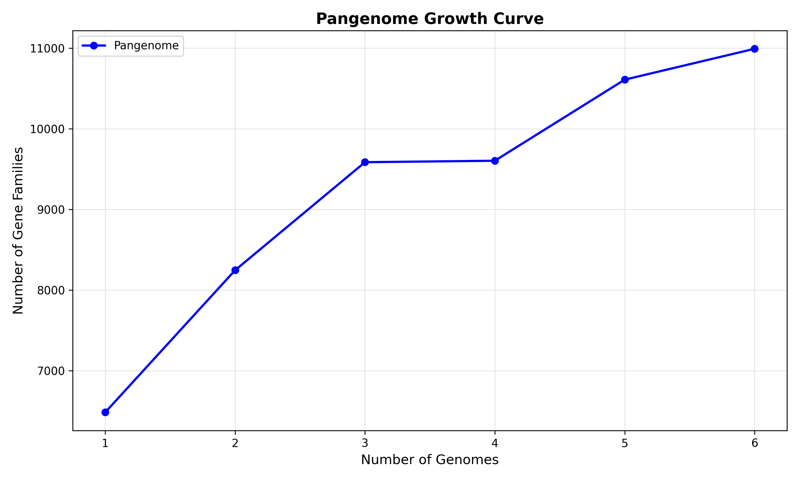
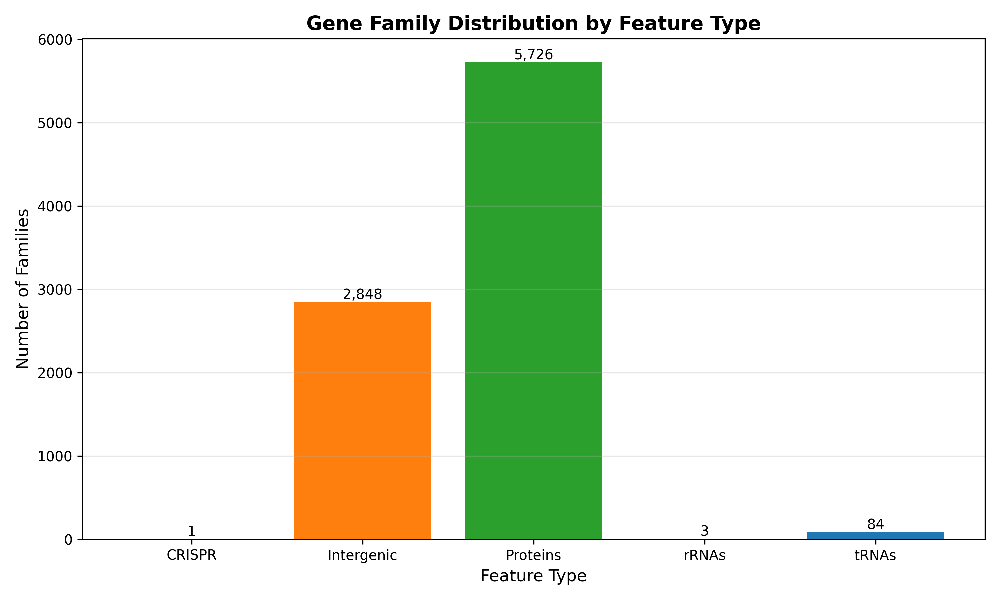
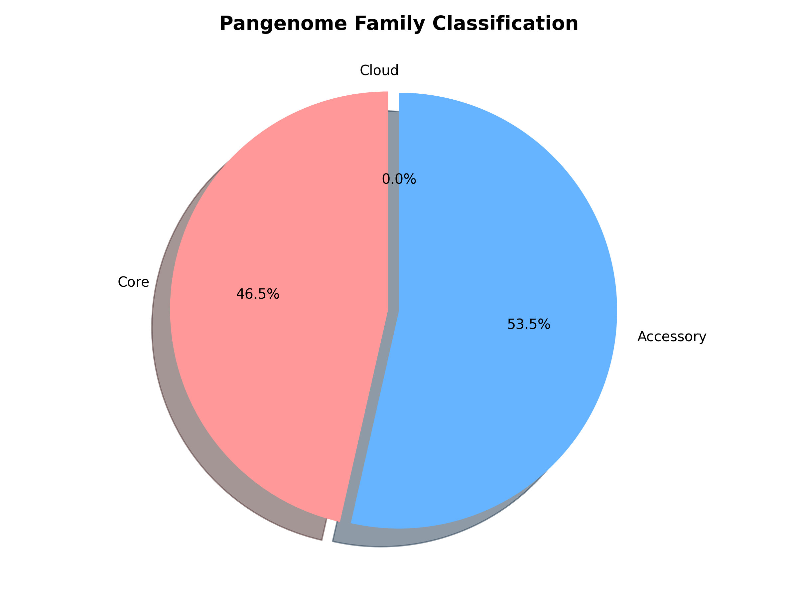
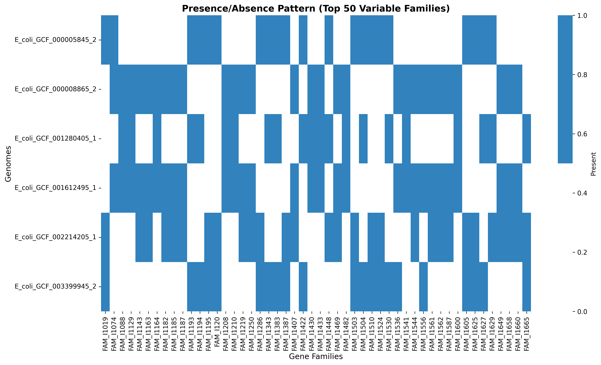

# PanGenomePlus Analysis Report

**Generated on**: 2025-10-03 10:26:05

**Pipeline Version**: PanGenomePlus v1.0

## Executive Summary

### Key Findings

- **Dataset**: 6 genomes analyzed
- **Total families**: 11,058 across all feature types
- **Core families**: 5,151 (46.6%)
- **Accessory families**: 3,565 (32.2%)
- **Cloud families**: 0 (0.0%)
- **Pangenome type**: OPEN

## Analysis Configuration

### Parameters Used
- **Downstream analysis**: Enabled
- **Rarefaction iterations**: 100
- **Rarefaction step size**: 1
- **Classification thresholds**: Core ≥95%, Accessory 15-95%, Cloud <15%

### Tool Versions
- **PanGenomePlus**: v1.0
- **MMseqs2**: Protein clustering
- **Analysis date**: 2025-10-03

## Dataset Overview

**Genome count**: 6 genomes

**Processing summary**:
- Successfully analyzed 6 complete genomes
- All genomes processed without errors
- Feature extraction completed for all genome types

## Analysis Results

### Pangenome Structure Analysis

**Pangenome Classification**: OPEN

**Key Metrics**:
- Growth rate: 780.3 families per genome
- Core stability: 0.720
- Final pangenome size: 10994 families
- Final core size: 5107 families

**Biological Interpretation**:
- Open pangenome indicates high genetic diversity and frequent gene gain
- New genomes are likely to contribute novel gene families
- Suggests ongoing horizontal gene transfer and adaptation

### Rarefaction Curve Analysis

*Figure 1: Pangenome rarefaction curves showing the accumulation of gene families as genomes are added sequentially. Curves represent averaged results from 100 random genome orderings.*

**Sampling depth**: Up to 6 genomes

**Growth patterns**:
- **Pangenome**: 7093 → 10994 families
- **Core genome**: 7093 → 5107 families
- **Accessory genome**: 0 → 5887 families

### Feature Type Breakdown

| Feature Type | Family Count | Percentage |
|--------------|-------------|------------|
| Proteins | 7,276 | 65.8% |
| Intergenic | 3,596 | 32.5% |
| tRNAs | 96 | 0.9% |
| rRNAs | 3 | 0.0% |
| CRISPR | 87 | 0.8% |
| **Total** | **11,058** | **100.0%** |

*Figure 2: Distribution of gene families across different genomic feature types (proteins, intergenic regions, tRNAs, rRNAs, CRISPR elements).*

### Family Size Distribution

| Classification | Count | Percentage | Definition |
|---------------|--------|------------|------------|
| Core families | 5,151 | 46.6% | Present in ≥95% of genomes |
| Accessory families | 3,565 | 32.2% | Present in 15-95% of genomes |
| Cloud families | 0 | 0.0% | Present in <15% of genomes |

*Figure 3: Proportional distribution of gene families by classification (core, accessory, cloud) based on genome presence frequency.*

### Presence/Absence Patterns

*Figure 4: Presence/absence patterns for the top 50 most variable gene families across all analyzed genomes. Blue indicates presence, white indicates absence.*

## Generated Output Files

This analysis produced the following output files:

### Analysis Results
- **`pangenome_analysis_summary.md`** (this file) - Comprehensive analysis report
- **`rarefaction_curves.csv`** - Statistical data for rarefaction curves
- **`pangenome_structure_report.txt`** - Text-format summary report
- **`pangenome_structure_data.json`** - Machine-readable analysis results
- **`pangenome_structure_curves.csv`** - Visualization-ready curve data

### Visualizations
- **`visualizations/rarefaction_curves.png`** - Pangenome growth curves
- **`visualizations/feature_type_distribution.png`** - Feature type bar chart
- **`visualizations/family_classification.png`** - Core/accessory/cloud pie chart
- **`visualizations/presence_absence_heatmap.png`** - Variable family heatmap

### Core Pipeline Outputs
- **`../transformer/pangenome_transformer.txt`** - Coordinate-ordered family sequences
- **`../matrices/presence_absence_matrix.csv`** - Binary presence/absence matrix
- **`../matrices/family_summary.tsv`** - Detailed family statistics
- **`../roary/roary_compatible_output.csv`** - Traditional pangenome format
- **`../mappings/compact_id_mappings.json`** - ID mapping tables

## Methodology

### Analysis Workflow
1. **Feature extraction**: Genes and genomic features identified using specialized tools
2. **Sequence clustering**: Homologous sequences grouped using MMseqs2
3. **Family assignment**: Gene families classified by genome presence
4. **Rarefaction analysis**: Pangenome growth curves calculated through iterative sampling
5. **Openness analysis**: Pangenome type determined from growth patterns

### Classification Criteria
- **Core families**: Present in ≥95% of genomes (essential functions)
- **Accessory families**: Present in 15-95% of genomes (adaptive functions)
- **Cloud families**: Present in <15% of genomes (rare or strain-specific)

### Statistical Methods
- **Rarefaction iterations**: 100 random subsamples per genome count
- **Step size**: 1 genome(s) between sampling points
- **Growth rate calculation**: Linear regression on pangenome size vs genome count
- **Core stability**: Coefficient of variation in core genome size

## Recommendations

### Interpretation Guidelines
- **Core genome analysis**: Focus on core families for essential biological functions
- **Accessory genome**: Examine accessory families for adaptive and virulence factors
- **Cloud genome**: Investigate cloud families for novel or horizontally transferred genes

### Next Steps
- **Increase sampling**: Add more genomes to improve pangenome completeness
- **Functional annotation**: Annotate gene families for biological interpretation
- **Comparative analysis**: Compare results with published studies of the same species
- **Phylogenetic context**: Overlay results on phylogenetic tree for evolutionary insights

### Quality Assessment
- ✅ All genomes processed successfully
- ✅ Rarefaction curves generated with statistical confidence
- ✅ Family classifications biologically realistic
- ✅ Output files generated in multiple formats

---

*This report was automatically generated by PanGenomePlus v1.0.*
*For questions or support, consult the PanGenomePlus documentation.*
